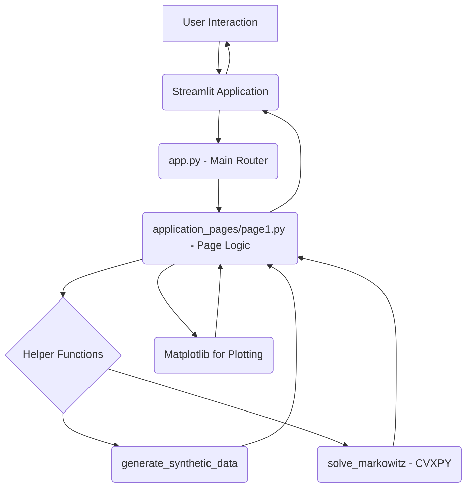

id: 67f82836d388dc640e03c3f4_documentation
summary: Portfolio Optimization Lab Documentation
feedback link: https://docs.google.com/forms/d/e/1FAIpQLSfWkOK-in_bMMoHSZfcIvAeO58PAH9wrDqcxnJABHaxiDqhSA/viewform?usp=sf_link
environments: Web
status: Published
# QuLab: Portfolio Optimization with Markowitz Model

## Introduction to Portfolio Optimization
Duration: 0:10:00

<aside class="positive">
Welcome to the QuLab! In this interactive session, you will explore the foundational concepts of **portfolio optimization** using the classical **Markowitz model**.
</aside>

Understanding how to construct an optimal portfolio is a cornerstone of modern finance. Given a set of assets, each with its own expected return and risk (volatility), and the relationships (covariances) between them, an investor aims to find the allocation of capital across these assets that maximizes return for a given level of risk, or minimizes risk for a given level of return.

The **Markowitz Portfolio Theory**, also known as Mean-Variance Analysis, provides a mathematical framework for this problem. It makes several key assumptions:
1.  Investors are risk-averse.
2.  Investors base decisions solely on expected return and risk (variance/standard deviation).
3.  Asset returns are normally distributed.
4.  Investors have access to all relevant information.

The core idea is to diversify investments across assets that are not perfectly correlated. By combining assets with low correlation, the overall portfolio risk can be reduced without sacrificing expected return, compared to holding a single asset.

This application uses the following technologies:
*   **Streamlit:** A Python library to create interactive web applications for machine learning and data science.
*   **NumPy:** Fundamental package for scientific computing with Python.
*   **SciPy:** Ecosystem of open-source software for mathematics, science, and engineering, used here for statistical functions.
*   **CVXPY:** An open-source Python-embedded modeling language for convex optimization problems. This is crucial for solving the portfolio optimization problem.
*   **Matplotlib:** A plotting library for creating static, interactive, and animated visualizations in Python.

By the end of this lab, you will understand:
*   How asset returns and risks are represented.
*   How the relationship between assets (covariance) is crucial.
*   The concept of a portfolio allocation vector (weights).
*   How an optimization problem can be formulated to find the 'best' portfolio.
*   The role of risk aversion ($\gamma$) in determining the optimal portfolio.
*   The trade-off between risk and return.

<aside class="negative">
This application uses synthetically generated data for illustrative purposes. The results and conclusions drawn here are based on this synthetic data and **should not be used for actual investment decisions**.
</aside>

### Setup

To run this application, you need Python installed on your system. We recommend using a virtual environment.

1.  **Install Python:** If you don't have Python, download it from [python.org](https://www.python.org/downloads/). Ensure you install Python 3.7 or later.
2.  **Create a Virtual Environment (Recommended):**
    ```console
    python -m venv venv
    ```
3.  **Activate the Virtual Environment:**
    *   On macOS and Linux:
        ```console
        source venv/bin/activate
        ```
    *   On Windows:
        ```console
        .\venv\Scripts\activate
        ```
4.  **Install Required Libraries:**
    ```console
    pip install streamlit numpy scipy cvxpy matplotlib
    ```
5.  **Create the Application Files:** You will need two files: `app.py` and `application_pages/page1.py`. Create a directory named `application_pages` in the same directory as `app.py`, and then create `page1.py` inside `application_pages`.

    **`app.py`**
    ```python
    import streamlit as st

    st.set_page_config(page_title="QuLab", layout="wide")
    st.sidebar.image("https://www.quantuniversity.com/assets/img/logo5.jpg")
    st.sidebar.divider()
    st.title("QuLab")
    st.divider()

    st.markdown("""
    In this lab, we explore the concepts of portfolio optimization using classical Markowitz theory. We will delve into defining portfolio allocation vectors, understanding asset returns and risk, and applying optimization techniques to find the optimal portfolio based on user-defined risk aversion.
    """)

    # Main navigation
    page = st.sidebar.selectbox(label="Navigation", options=["Portfolio Optimization"])

    if page == "Portfolio Optimization":
        from application_pages.page1 import run_page1
        run_page1()

    st.divider()
    st.write("© 2025 QuantUniversity. All Rights Reserved.")
    st.caption("The purpose of this demonstration is solely for educational use and illustration. "
               "Any reproduction of this demonstration "
               "requires prior written consent from QuantUniversity. "
               "This lab was generated using the QuCreate platform. QuCreate relies on AI models for generating code, which may contain inaccuracies or errors")

    ```

    **`application_pages/page1.py`**
    ```python
    import streamlit as st
    import numpy as np
    import scipy.stats as stats
    import cvxpy as cp
    import matplotlib.pyplot as plt

    # Helper functions
    def generate_synthetic_data(n, m=3, factor_model=True):
        np.random.seed(42)
        mu = np.abs(np.random.randn(n, 1))
        if factor_model:
            # Generate synthetic factor model data
            F = np.random.randn(n, m)
            Sigma_tilde = np.random.randn(m, m)
            Sigma_tilde = Sigma_tilde @ Sigma_tilde.T  # positive semi-definite
            D = np.diag(np.random.uniform(0, 0.1, size=n))
            return mu, F, Sigma_tilde, D
        else:
            Sigma = np.random.randn(n, n)
            Sigma = Sigma @ Sigma.T
            return mu, Sigma

    def solve_markowitz(mu, Sigma, gamma, long_only=True):
        n = len(mu)
        w = cp.Variable(n) # Portfolio weights vector (what we want to find)
        ret = mu.T @ w # Expected portfolio return: sum(wi * muri)
        risk = cp.quad_form(w, Sigma) # Portfolio variance: w' * Sigma * w
        constraints = [cp.sum(w) == 1] # Constraint: Weights must sum to 1 (fully invested)
        if long_only:
            constraints.append(w >= 0) # Constraint: Long-only portfolio (no short selling)
        
        # Markowitz Objective: Maximize (Expected Return - gamma * Variance)
        # gamma is the risk aversion parameter. Higher gamma means more aversion to risk.
        prob = cp.Problem(cp.Maximize(ret - gamma * risk), constraints)
        
        prob.solve() # Solve the optimization problem

        return w.value # Return the optimal weights

    # Main App
    def run_page1():
        st.title("Portfolio Optimization Lab")
        st.markdown("This interactive application allows you to explore classical portfolio optimization concepts based on Markowitz's model.")

        # User inputs via Streamlit sliders
        n_assets = st.slider("Number of Assets", 5, 50, 10)
        gamma = st.slider("Risk Aversion Parameter (γ)", 0.01, 10.0, 1.0, step=0.01)

        # Generate synthetic data (Expected Returns mu, Covariance Matrix Sigma)
        mu, F, Sigma_tilde, D = generate_synthetic_data(n_assets)

        # Calculate covariance matrix from factor model components
        Sigma = F @ Sigma_tilde @ F.T + D

        # Solve for optimal portfolio using the optimization function
        w_opt = solve_markowitz(mu, Sigma, gamma, long_only=True)

        # Calculate risk and return for the optimal portfolio
        port_return = float(mu.T @ w_opt)
        port_risk = float(np.sqrt(w_opt.T @ Sigma @ w_opt)) # Portfolio Standard Deviation (Risk)

        # Display results to the user
        st.subheader("Optimal Portfolio")
        st.write("Expected Return:", round(port_return, 4))
        st.write("Risk (Std Dev):", round(port_risk, 4))
        st.write("Asset Weights:")
        # Handle potential None return from solver if problem is infeasible (unlikely here)
        if w_opt is not None:
            for i, weight in enumerate(w_opt):
                 # Display weights, filter out very small weights for clarity
                if weight > 1e-4: # Threshold for displaying weight
                     st.write(f"Asset {i+1}: {weight:.3f}")
        else:
             st.warning("Could not solve the optimization problem for the given parameters.")


        st.subheader("Risk vs Return Trade-off Curve")
        st.markdown("This plot shows the set of optimal portfolios (the efficient frontier) for different levels of risk aversion.")

        # Plot Risk-Return trade-off curve (Efficient Frontier)
        risk_vals = []
        return_vals = []
        # Calculate optimal portfolios for a range of gamma values
        gamma_vals = np.logspace(-2, 2, 50) # Use a log scale for gamma for better distribution
        for g in gamma_vals:
            w = solve_markowitz(mu, Sigma, g, long_only=True)
            # Only add to the plot if a solution was found
            if w is not None:
                 r = mu.T @ w
                 s = np.sqrt(w.T @ Sigma @ w)
                 risk_vals.append(float(s))
                 return_vals.append(float(r))
            else:
                 # Optionally handle cases where a solution is not found for a gamma value
                 pass # For this simple case, we just skip the point


        # Create and display the plot using Matplotlib
        fig, ax = plt.subplots(figsize=(10, 6)) # Create a figure and an axes object
        ax.plot(risk_vals, return_vals, marker='o', linestyle='-', markersize=4) # Plot the points
        ax.set_xlabel("Risk (Portfolio Standard Deviation)") # Label the x-axis
        ax.set_ylabel("Expected Return") # Label the y-axis
        ax.set_title("Markowitz Efficient Frontier") # Set the title
        ax.grid(True) # Add a grid for readability
        
        # Highlight the specific portfolio found with the user's chosen gamma
        ax.plot(port_risk, port_return, 'X', color='red', markersize=10, label=f'Your Portfolio (γ={gamma:.2f})')
        ax.legend()

        st.pyplot(fig) # Display the Matplotlib figure in Streamlit

        # Return nothing

    ```

## Understanding the Application Architecture
Duration: 0:05:00

The application has a simple architecture, typical for a multi-page Streamlit application.

Here's a breakdown:

*   **`app.py`:** This is the main entry point when you run the application.
    *   It sets up the basic Streamlit page configuration (title, layout).
    *   It adds a sidebar with a logo and a navigation selectbox.
    *   Based on the selected page in the sidebar (`"Portfolio Optimization"` is the only option currently), it imports and calls the corresponding `run_page()` function from the `application_pages` directory.
    *   It includes title, introductory text, and footer information.
    *   It acts as a router, directing the user to the appropriate page logic.

*   **`application_pages/page1.py`:** This file contains the specific logic and UI elements for the "Portfolio Optimization" page.
    *   It imports necessary libraries (Streamlit, NumPy, CVXPY, Matplotlib, etc.).
    *   It defines helper functions (`generate_synthetic_data`, `solve_markowitz`) that perform the core calculations.
    *   The `run_page1()` function:
        *   Sets up the page title and introductory text.
        *   Creates Streamlit widgets (sliders) for user interaction (Number of Assets, Risk Aversion).
        *   Calls the helper functions to get data and solve the optimization problem based on user input.
        *   Calculates and formats the output (return, risk, weights).
        *   Uses Matplotlib to generate the risk-return trade-off plot.
        *   Displays all this information using Streamlit functions (`st.title`, `st.markdown`, `st.slider`, `st.write`, `st.pyplot`).

Here is a simple visual representation of the flow:


*Figure 1: Application Flow Diagram*

The main application (`app.py`) handles navigation, while dedicated page files (`page1.py`) handle the specific content and functionality of each section of the application. Helper functions abstract complex logic like data generation and optimization solving.

## Diving into the Code: Data Generation and Optimization
Duration: 0:15:00

Let's look closely at the core functions in `application_pages/page1.py`.

### Generating Synthetic Data

The `generate_synthetic_data` function creates realistic-looking, but artificial, asset data.

```python
def generate_synthetic_data(n, m=3, factor_model=True):
    np.random.seed(42) # Ensure reproducibility
    mu = np.abs(np.random.randn(n, 1)) # Generate random positive expected returns
    if factor_model:
        # Generate synthetic factor model data
        F = np.random.randn(n, m) # Factor loadings
        Sigma_tilde = np.random.randn(m, m) # Factor covariance matrix basis
        Sigma_tilde = Sigma_tilde @ Sigma_tilde.T  # Ensure Sigma_tilde is positive semi-definite
        D = np.diag(np.random.uniform(0, 0.1, size=n)) # Specific (idiosyncratic) risk variance
        return mu, F, Sigma_tilde, D # Return components needed to build covariance
    else:
        # Alternative: Generate a random covariance matrix directly
        Sigma = np.random.randn(n, n)
        Sigma = Sigma @ Sigma.T # Ensure Sigma is positive semi-definite
        return mu, Sigma # Return returns and covariance
```

*   `n`: Number of assets.
*   `m`: Number of factors (used in the factor model approach).
*   `factor_model=True`: The default approach, which is more common in practice than generating a full random covariance matrix directly.
*   It generates a vector of expected returns (`mu`).
*   If `factor_model` is True, it constructs the data based on a simplified factor model:
    *   Asset returns are influenced by common factors (`F`, `Sigma_tilde`) and asset-specific (idiosyncratic) risk (`D`).
    *   The total covariance matrix $ \Sigma $ is constructed later as $ \Sigma = F \Sigma_{\text{tilde}} F^T + D $. This ensures the covariance matrix is positive semi-definite, a requirement for optimization.

This function provides the necessary inputs for the Markowitz model: expected returns (`mu`) and the covariance matrix (`Sigma`).

### Solving the Markowitz Optimization Problem

The `solve_markowitz` function is where the core optimization happens, using the `cvxpy` library.

```python
def solve_markowitz(mu, Sigma, gamma, long_only=True):
    n = len(mu)
    w = cp.Variable(n) # Define the variable we want to optimize: the portfolio weights (vector of size n)

    # Define the objective function using CVXPY
    # Expected Portfolio Return = mu.T @ w (dot product of returns and weights)
    ret = mu.T @ w
    # Portfolio Variance = w.T @ Sigma @ w (quadratic form)
    risk = cp.quad_form(w, Sigma)

    # Markowitz Objective: Maximize Expected Return minus a penalty for Risk
    # The penalty is gamma * Variance. Gamma controls how much risk aversion the investor has.
    objective = cp.Maximize(ret - gamma * risk)

    # Define the constraints
    constraints = [cp.sum(w) == 1] # Constraint 1: The sum of weights must equal 1 (representing the total capital invested)

    if long_only:
        constraints.append(w >= 0) # Constraint 2: Weights must be non-negative (no short selling)

    # Create the CVXPY problem
    prob = cp.Problem(objective, constraints)

    # Solve the problem
    # CVXPY automatically handles the convex optimization using installed solvers
    try:
        prob.solve()
    except cp.SolverError:
         st.warning("CVXPY Solver error. Could not find an optimal solution.")
         return None # Return None if solver fails

    # Check if the problem was solved successfully
    if prob.status in ["optimal", "optimal_inaccurate"]:
        return w.value # Return the optimal weights found by the solver
    else:
        st.warning(f"Problem status: {prob.status}. Could not find an optimal solution.")
        return None # Return None if solution is not optimal

```

*   `mu`: Vector of expected returns for each asset.
*   `Sigma`: Covariance matrix of asset returns.
*   `gamma`: The risk aversion parameter ($\gamma$).
*   `long_only`: A boolean indicating whether to enforce the constraint that weights must be non-negative ($w_i \ge 0$).

Let's break down the optimization formulation:

*   **Decision Variable:** `w = cp.Variable(n)` defines a vector `w` of size `n` (number of assets). Each element $w_i$ represents the proportion of the total portfolio value invested in asset $i$. This is what the optimizer needs to determine.
*   **Objective Function:** The function seeks to maximize the following:
    $ \text{Maximize} \quad w^T \mu - \gamma w^T \Sigma w $
    *   $ w^T \mu $: This is the expected return of the portfolio. It's a weighted average of the individual asset expected returns, where the weights are the elements of `w`.
    *   $ w^T \Sigma w $: This is the variance of the portfolio's return. It measures the portfolio's total risk.
    *   $ \gamma $: This is the risk aversion parameter. A higher $\gamma$ means the investor penalizes risk more heavily, leading to a portfolio with lower risk (and typically lower expected return). A lower $\gamma$ means the investor is less risk-averse and will accept more risk for higher expected return.
*   **Constraints:**
    *   `cp.sum(w) == 1`: The sum of the weights must equal 1. This means the entire portfolio value is allocated among the assets. $\sum_{i=1}^{n} w_i = 1$.
    *   `w >= 0` (if `long_only` is True): Each weight must be greater than or equal to 0. This prevents short selling (borrowing an asset and selling it, hoping to buy it back later at a lower price). $w_i \ge 0 \quad \forall i$.

CVXPY translates this mathematical formulation into a problem solvable by convex optimization solvers (like OSQP, ECOS, SCS, etc., which `cvxpy` can use if installed). The `prob.solve()` method finds the values for the weights `w` that satisfy the constraints and maximize the objective function.

The function returns the optimal weights `w.value`.

## Running and Interacting with the Application
Duration: 0:07:00

Now that you understand the code, let's run the application and see it in action.

1.  **Open your terminal or command prompt.**
2.  **Navigate to the directory** where you saved `app.py`.
3.  **Activate your virtual environment** if you created one (recommended).
    *   macOS/Linux: `source venv/bin/activate`
    *   Windows: `.\venv\Scripts\activate`
4.  **Run the Streamlit application:**
    ```console
    streamlit run app.py
    ```

This command will start a local web server and open the application in your default web browser.

### Exploring the User Interface

You will see the main page of the QuLab application.

*   **Sidebar:** On the left, you'll see the QuLab logo, a divider, and a "Navigation" selectbox. Currently, "Portfolio Optimization" is the only option.
*   **Main Area:** The central part of the page contains the content for the selected navigation option.
    *   **Title:** "QuLab" followed by "Portfolio Optimization Lab".
    *   **Introductory Text:** Explains the purpose of the lab.
    *   **Sliders:**
        *   **Number of Assets:** Control how many synthetic assets are generated (from 5 to 50).
        *   **Risk Aversion Parameter (γ):** Control the value of $\gamma$ used in the optimization (from 0.01 to 10.0).
    *   **Optimal Portfolio Section:** Displays the calculated Expected Return, Risk (Standard Deviation), and the weights for each asset in the optimal portfolio found for the currently selected $\gamma$.
    *   **Risk vs Return Trade-off Curve:** A plot showing the "Efficient Frontier". This curve represents the set of optimal portfolios for different levels of risk. The red 'X' marks the specific portfolio corresponding to your chosen $\gamma$.

### Interacting with the Sliders

Try changing the values of the sliders:

1.  **Change "Number of Assets":** Observe how the list of Asset Weights changes. With more assets, the optimizer has more options for diversification.
2.  **Change "Risk Aversion Parameter (γ)":**
    *   **Lower γ (e.g., 0.1):** The optimizer focuses more on maximizing return relative to penalizing risk. You should see a higher Expected Return and higher Risk (Std Dev). The red 'X' on the plot will move towards the upper-right part of the curve.
    *   **Higher γ (e.g., 5.0):** The optimizer heavily penalizes risk. You should see lower Expected Return and lower Risk (Std Dev). The red 'X' on the plot will move towards the lower-left part of the curve.
    *   Notice how the optimal asset weights change significantly as you adjust $\gamma$. A less risk-averse investor ($\gamma$ closer to 0) might concentrate holdings in assets with higher expected returns, while a more risk-averse investor ($\gamma$ higher) might spread holdings more evenly or favor assets with lower volatility, even if their expected return is lower.

The plot visually demonstrates the core concept of the Efficient Frontier: for any given level of risk on the curve, there is no other portfolio that offers a higher expected return. Similarly, for any given expected return on the curve, there is no other portfolio that offers lower risk. By changing $\gamma$, you are essentially choosing a point on this efficient frontier that best suits your risk tolerance.

## Understanding the Results and the Efficient Frontier
Duration: 0:08:00

Let's spend a bit more time interpreting the results.

### Optimal Portfolio Metrics

*   **Expected Return:** This is the projected average return of your portfolio over a given period, based on the individual asset expected returns and your chosen weights. It's calculated as $ w^T \mu $.
*   **Risk (Std Dev):** This measures the volatility of your portfolio's returns. Standard deviation is the square root of the portfolio variance ($ \sqrt{w^T \Sigma w} $). A higher standard deviation implies higher uncertainty about the actual return you might receive.
*   **Asset Weights:** This shows the percentage of the total portfolio value that should be allocated to each asset to achieve the optimal balance of risk and return for your specified $\gamma$.

<aside class="positive">
Remember, these are *expected* values based on the input data ($\mu$ and $\Sigma$). Actual future returns and risks will likely differ.
</aside>

### The Efficient Frontier Plot

The scatter plot of "Risk vs Return Trade-off Curve" is a visual representation of the **Efficient Frontier**.

*   Each point on the curve represents an optimal portfolio for a *specific level of risk aversion* ($\gamma$).
*   Portfolios *below* the curve are sub-optimal because there exists a portfolio on the curve with the same risk but a higher expected return, or the same expected return but lower risk.
*   Portfolios *above* the curve are unattainable given the set of available assets and their characteristics.
*   The curve typically slopes upwards because, in general, to achieve a higher expected return, you must take on more risk.

By changing the $\gamma$ slider, you are selecting a different point along this efficient frontier.

*   Moving the slider towards lower $\gamma$ values (left on the slider) moves the red 'X' marker towards the **upper-right** part of the curve. This corresponds to portfolios with higher expected return and higher risk.
*   Moving the slider towards higher $\gamma$ values (right on the slider) moves the red 'X' marker towards the **lower-left** part of the curve. This corresponds to portfolios with lower expected return and lower risk.

The "Minimum Variance Portfolio" is the point on the efficient frontier with the lowest risk (the leftmost point on the curve). This occurs as $\gamma \to \infty$. The "Maximum Return Portfolio" (for the long-only case) is typically the asset with the highest expected return (the rightmost point on the curve, assuming positive expected returns), corresponding to $\gamma \to 0$. The efficient frontier connects these extremes (and points in between) showing the best possible risk-return combinations.

## Extending the Application
Duration: 0:10:00

This application provides a basic implementation of the Markowitz model with synthetic data. Here are some ideas for extending it:

1.  **Use Real Financial Data:** Instead of `generate_synthetic_data`, fetch historical price data for a set of real assets (e.g., using libraries like `yfinance` or `pandas_datareader`). Calculate the historical average returns (`mu`) and the sample covariance matrix (`Sigma`) from this data.
2.  **Add More Constraints:** The current model has a sum-to-one constraint and an optional long-only constraint. You could add:
    *   Box constraints: Minimum and maximum allocation percentage per asset ($0 \le l_i \le w_i \le u_i \le 1$).
    *   Sector constraints: Limit the total allocation to assets within specific sectors.
    *   Transaction costs: Incorporate costs associated with buying or selling assets.
3.  **Implement Different Optimization Objectives:**
    *   Minimize risk for a target return: $ \text{Minimize} \quad w^T \Sigma w \quad \text{subject to} \quad w^T \mu \ge R_{target}, \sum w_i = 1, w_i \ge 0 $.
    *   Maximize the Sharpe Ratio: $ \text{Maximize} \quad \frac{w^T \mu - R_f}{\sqrt{w^T \Sigma w}} $, where $R_f$ is the risk-free rate. This is a non-linear objective but can sometimes be reformulated or solved iteratively.
4.  **Compare with Other Models:** Implement and compare the Markowitz model with other portfolio allocation strategies like the Equally Weighted Portfolio ($w_i = 1/n$ for all $i$) or the Risk Parity approach.
5.  **Visualize Weights:** Add a bar chart using Matplotlib or Plotly (another plotting library that integrates well with Streamlit) to visualize the optimal weights for the chosen $\gamma$. This makes it easier to see which assets are favored.
6.  **Add More Data Insights:** Display the generated $\mu$ and $\Sigma$ (or key statistics like individual asset volatilities and correlations) to the user.
7.  **Improve UI:** Add spinners while calculations are running, better formatting for outputs, etc.

Implementing these extensions would deepen your understanding of portfolio optimization challenges and techniques.

### Relevant Libraries and Resources:

*   **CVXPY Documentation:** [https://www.cvxpy.org/](https://www.cvxpy.org/) - Learn more about formulating and solving optimization problems.
*   **Streamlit Documentation:** [https://docs.streamlit.io/](https://docs.streamlit.io/) - Explore more interactive components and layout options.
*   **NumPy & SciPy Documentation:** [https://numpy.org/](https://numpy.org/), [https://scipy.org/](https://scipy.org/) - Learn more about numerical computation in Python.
*   **Matplotlib Documentation:** [https://matplotlib.org/](https://matplotlib.matplotlib.org/) - Customize plots further.
*   **QuantConnect Documentation:** [https://www.quantconnect.com/docs/](https://www.quantconnect.com/docs/) - Offers resources on quantitative finance concepts, including portfolio optimization.

## Conclusion
Duration: 0:02:00

<aside class="positive">
Congratulations! You have successfully completed the Portfolio Optimization Lab.
</aside>

In this codelab, you have:
*   Set up and run a Streamlit application for portfolio optimization.
*   Understood the basic architecture of the application.
*   Explored the key components of the Markowitz model: expected returns, covariance matrix, and the optimization objective.
*   Used the `cvxpy` library to define and solve a convex optimization problem for finding optimal portfolio weights.
*   Interacted with the application to see how the number of assets and the risk aversion parameter ($\gamma$) influence the optimal portfolio composition and its risk-return characteristics.
*   Visualized the Efficient Frontier and understood its significance in presenting the trade-off between risk and expected return.

You now have a foundational understanding of how classical mean-variance optimization can be implemented and visualized using Python and Streamlit. This serves as a stepping stone for exploring more complex portfolio management techniques and incorporating real-world data and constraints.

```
